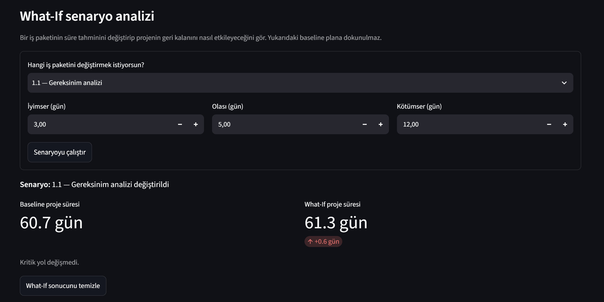
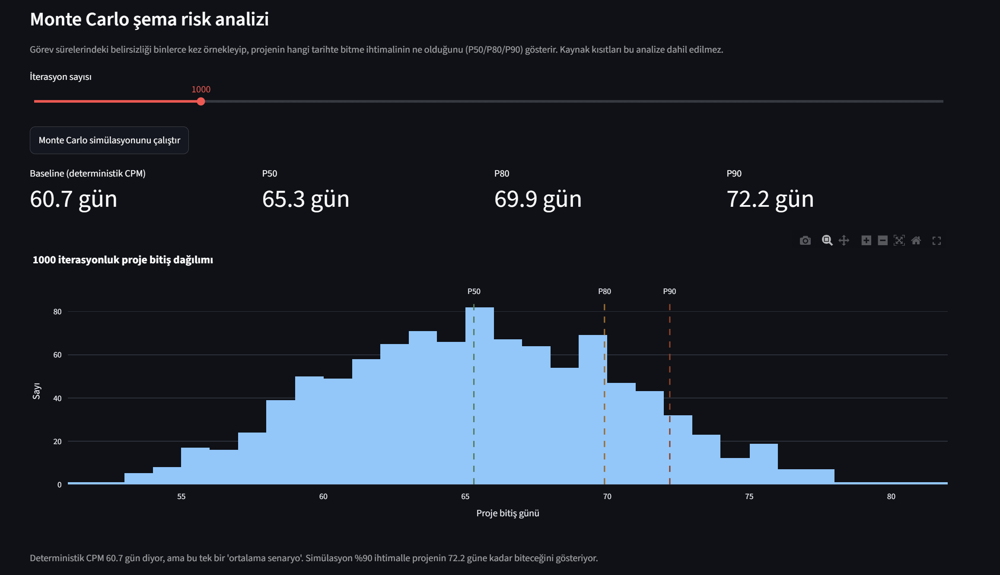
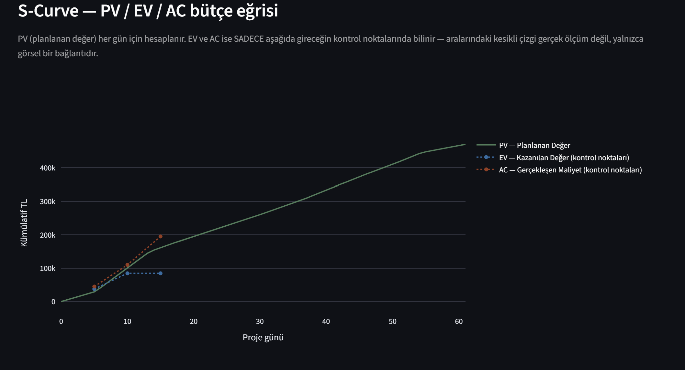
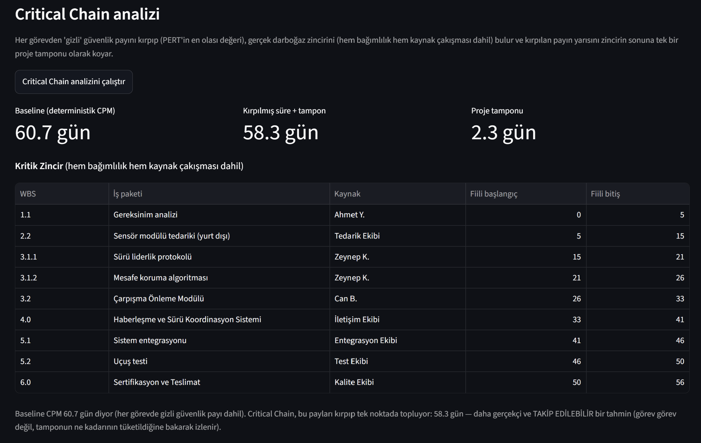
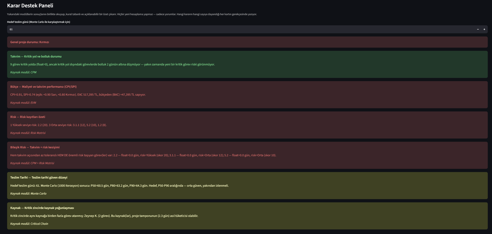

# ANKA-SÜRÜ — Otonom Sürü İHA Geliştirme Projesi | PMO Kontrol Paneli

*A Python-based Project Management Office (PMO) dashboard, built to demonstrate*
*OOP-driven project management mathematics for a fictional defense-industry program.*

---

## 🇹🇷 Türkçe

### Proje Hakkında

ANKA-SÜRÜ, kurgusal bir "Otonom Sürü İHA" geliştirme projesinin **Proje Yönetim Ofisi (PMO)**
süreçlerini uçtan uca modelleyen, Python ve Nesne Yönelimli Programlama (OOP) ile
geliştirilmiş bir kontrol panelidir. Bu proje, Yönetim Bilişim Sistemleri (YBS) geçmişiyle
proje yönetimi teorisini ve yazılım geliştirme pratiğini birleştirme becerisini göstermek
amacıyla hazırlanmıştır.

Amaç, PMO'da kullanılan klasik yöntemleri (WBS, CPM, PERT, EVM vb.) sadece teorik olarak
bilmek değil, bu yöntemlerin **matematiksel mantığını kodla ifade edebilmektir.**

### Neden Bu Proje?

Türkiye'nin lider savunma sanayii ve teknoloji şirketlerinde (ASELSAN, TUSAŞ, HAVELSAN gibi)
PMO veya Sistem Analistliği rollerine hazırlanırken, bilgimi sadece CV'de bir cümle olarak
değil, somut ve incelenebilir bir eser olarak göstermek istedim. Bu proje, YBS eğitimimin
kazandırdığı proje yönetimi teorisiyle, kendi kendime geliştirdiğim Python/OOP becerilerini
birleştiren bir portföy çalışmasıdır.

### Teknoloji Yığını

- **Python 3.x**
- **Streamlit** — arayüz
- **pandas** — tablo/veri işleme
- **Plotly** — interaktif grafikler (Gantt, histogram, risk matrisi, S-Curve)
- **pytest** — otomatik test suite

### Uygulanan PMO Metodolojileri

| Modül | Ne Yapar | Temel Formül/Mantık |
|---|---|---|
| **WBS** (İş Kırılım Yapısı) | Projeyi hiyerarşik iş paketlerine böler | Ağaç yapısı (composite pattern) |
| **CPM** (Kritik Yol Metodu) | En erken bitiş tarihini ve kritik görevleri bulur | ES/EF (ileri geçiş), LS/LF (geri geçiş), Float = LS−ES |
| **PERT** (Olasılıksal Süre Tahmini) | Belirsiz süreleri istatistiksel olarak modeller | TE = (O+4M+P)/6, σ = (P−O)/6 |
| **EVM** (Kazanılmış Değer Yönetimi) | Bütçe/takvim performansını ölçer, bitiş maliyetini öngörür | SPI = EV/PV, CPI = EV/AC, EAC = BAC/CPI |
| **Kaynak Kısıtlı Zamanlama** | Aynı kaynağın çakışan atamalarını, HEM bağımlılık HEM kaynak müsaitliğini gözeterek çözer | Kaynak-kısıtlı ileri geçiş (serial schedule generation), float önceliğiyle |
| **Risk Matrisi** | Riskleri olasılık × etki ile skorlar | Risk Skoru = Olasılık × Etki |
| **What-If Senaryo Analizi** | Bir görevin süre tahmini değişirse projenin nasıl etkileneceğini, baseline'a dokunmadan gösterir | Taze WBS ağacı + hedef görevin PERT değerleri değiştirilip CPM yeniden çalıştırılır |
| **Monte Carlo Şema Risk Analizi** | Süre belirsizliğinin proje bitişine etkisini binlerce simülasyonla ölçer | Her iterasyonda üçgen dağılımdan örneklenen süre + CPM, P50/P80/P90 yüzdelik dilimleri |
| **S-Curve (PV/EV/AC)** | Bütçe/ilerleme performansını proje boyunca kümülatif olarak görselleştirir | PV her gün için hesaplanır (plana dayalı); EV/AC yalnızca girilen kontrol noktalarında bilinir |
| **Critical Chain** | Gizli güvenlik paylarını kırpıp gerçek darboğaz zincirini (bağımlılık + kaynak) bulur, tek bir proje tamponuyla korur | Kırpılmış süre (PERT 'olasi') + kaynak-kısıtlı CPM, geriye doğru darboğaz izleme, tampon = kırpılan payın yarısı |
| **Karar Destek Sistemi (DSS)** | Yukarıdaki modüllerin sonuçlarını birlikte yorumlayıp kural tabanlı, açıklanabilir karar kartları ve genel bir proje durum ışığı üretir | Eşik tabanlı kurallar (ör. CPI/SPI < 0.90/0.80) + modüller arası kesişim analizi (ör. kritiğe yakın + yüksek riskli görev kesişimi); yapay zeka/kara kutu tahmin kullanılmaz |

### Ekran Görüntüleri

**Proje sağlık özeti — BAC/CPI/SPI/EAC metrikleri ve WBS hiyerarşisi**


**Kritik yol analizi — CPM tablosu ve Gantt şeması**


**Kazanılmış değer performansı ve bütçe sapma trendi (EAC)**


**Olasılık × Etki risk skorlaması ve risk matrisi**


**What-If senaryo analizi — baseline ile senaryo süresi karşılaştırması**


**Monte Carlo şema risk analizi — proje bitiş tarihi dağılımı ve P50/P80/P90**


**S-Curve — kümülatif PV/EV/AC bütçe eğrisi**


**Critical Chain analizi — gerçek darboğaz zinciri ve proje tamponu**


**Karar Destek Paneli — genel proje durum ışığı ve gerekçeli karar kartları**


### Mimari

Proje, **hesaplama mantığı** ile **veri**, **karar yorumu** ve **arayüzü** birbirinden ayıran
katmanlı bir mimariyle kuruldu:

```
anka_suru_core.py   → WorkPackage sınıfı: tüm PMO matematiği burada
proje_verisi.py      → ANKA-SÜRÜ'nün gerçek WBS ağacı, bu sınıfı kullanarak kurulur
karar_destek.py       → Mevcut modüllerin sonuçlarını yorumlayan karar destek katmanı
app.py                → Streamlit arayüzü; SADECE görselleştirme yapar, hesaplama yapmaz
```

Bu ayrım, "separation of concerns" (kaygıların ayrılması) prensibinin somut bir uygulamasıdır:
veri veya arayüz değişse bile, çekirdek hesaplama mantığına dokunulmaz.

`proje_verisi.py` içinde ağaç kurulumu (`agaci_kur()`) ile hesaplama (`hesapla()`)
de kendi içinde ayrılmıştır. Bu sayede What-If senaryoları ve Monte Carlo simülasyonu,
orijinal (baseline) plana hiç dokunmadan, her seferinde temiz/taze bir proje ağacı
üzerinde çalışabilir.

`karar_destek.py`, klasik DSS (Karar Destek Sistemi) mimarisindeki üçüncü bileşeni temsil
eder — veri yönetimi (`proje_verisi.py`) ve model yönetiminin (`anka_suru_core.py`) üzerine
eklenen karar/yorum katmanı. Bu dosya, diğer ikisinden **hiçbir şey import etmez**; sadece
kendisine verilen, zaten hesaplanmış sonuçları (WorkPackage nesneleri, Monte Carlo ve
Critical Chain çıktıları) okuyup yorumlar. Bu sayede hesaplama motoruna hiç dokunmadan,
mevcut modüllerin tek başına göremediği bileşik durumları (ör. hem kritiğe yakın hem yüksek
riskli bir görev) yakalayabilir — ama nihai kararı (hangi eylemin seçileceğini) kasıtlı
olarak insana bırakır.

Somut bir örnek: CPM'in hesapladığı float (bolluk) değeri doğrudan Karar Destek Paneli'nin
"Takvim" kartında, Risk Matrisi'nin risk skorları "Bileşik Risk" kartında, Monte Carlo'nun
P50/P80/P90 çıktısı ise "Teslim Tarihi" kartında okunur. `karar_destek.py` bu sayıları asla
yeniden hesaplamaz — sadece halihazırda hesaplanmış sonuçları birbirine karşı okuyup yorumlar.

### Test Durumu

Proje, `pytest` ile yazılmış **32 otomatik testle** kapsanıyor — CPM, PERT, EVM, Risk Matrisi,
Kaynak Dengeleme, Critical Chain, Monte Carlo, What-If ve Karar Destek Sistemi'nin her biri
için ayrı testler içeriyor (sıfır bütçe, eksik veri, küçük iterasyon sayısı gibi uç durumlar
dahil).

```bash
pytest test_anka_suru.py -v
```

Şu an itibarıyla **32/32 test geçiyor.** `app.py` (Streamlit arayüzü) bu otomatik test setinin
kapsamı dışında; hesaplama mantığının tamamı (`anka_suru_core.py`, `proje_verisi.py`,
`karar_destek.py`) test kapsamındadır.

### Kurulum ve Çalıştırma

```bash
pip install streamlit pandas plotly
streamlit run app.py
```

### Öne Çıkan Teknik Detaylar

- **Özyinelemeli (recursive) algoritmalar:** CPM'in ileri/geri geçişi ve WBS ağaç gezinimi,
  görevlerin birbirini tetiklediği özyinelemeli fonksiyonlarla çözüldü.
- **Composite Pattern:** WBS hiyerarşisi, klasik bir nesne yönelimli tasarım deseniyle modellendi.
- **Streamlit `session_state`:** Kullanıcının girdiği EVM kontrol noktaları, sayfa yeniden
  çalıştığında kaybolmadan biriktirildi.
- **Plotly ile interaktif görselleştirme:** Gantt şeması, risk scatter plot, Monte Carlo dağılım histogramı ve S-Curve (PV/EV/AC) dahil EAC trend grafikleri.
- **Strategy Pattern:** CPM ve kaynak dengeleme fonksiyonları, süre hesaplama yöntemini
  (`sure_hesapla` parametresi) dışarıdan alacak şekilde tasarlandı — aynı hesaplama motoru,
  hiç kopyalanmadan hem deterministik (`beklenen_sure`), hem rastgele (Monte Carlo için
  `rastgele_sure`), hem kırpılmış (Critical Chain için `kirpik_sure`) modda çalışabiliyor.
- **Kural Tabanlı Karar Destek:** Yapay zeka veya kara kutu tahmin kullanılmadı — her karar
  kartı, eşik tabanlı kurallara (ör. CPI/SPI < 0.90/0.80) ve modüller arası kesişim analizine
  dayanıyor; hangi kararın hangi sayıya dayandığı her kartın gerekçesinde açıkça yazıyor
  (açıklanabilirlik).

### Sınırlamalar / Kapsam Dışı

Bu proje bir Primavera P6 veya MS Project alternatifi **değildir** — PMO'da kullanılan temel
yöntemlerin matematiksel mantığını öğrenip çalışan bir sisteme dönüştürmek amacıyla hazırlanmış
bir portföy/öğrenme projesidir. Bilinen sınırlar:

- Proje verisi (WBS, süreler, bütçe, kaynaklar) kurgusal ve koda sabit olarak gömülü;
  kullanıcı arayüzden kendi projesini yükleyemez.
- Kaynak dengeleme, endüstriyel bir zamanlama motoru değil, basit ve açıklanabilir bir
  sezgisel (heuristic) algoritmadır (float önceliğine dayalı serial schedule generation).
- Karar Destek Sistemi kural tabanlıdır; makine öğrenmesi veya istatistiksel tahminleme
  içermez.
- Çoklu kullanıcı desteği, veritabanı ile veri kalıcılığı veya kimlik doğrulama gibi kurumsal
  özellikler yoktur — tek oturumluk bir demo panelidir.

---

## 🇬🇧 English

### About the Project

ANKA-SÜRÜ is a Python-based PMO (Project Management Office) dashboard that models the
end-to-end management of a fictional "Autonomous Swarm UAV" development program. Built with
Object-Oriented Programming principles, it was created to demonstrate the ability to combine
a Management Information Systems (MIS) background with hands-on software engineering —
translating classical project management theory into working, testable code.

The goal was not just to *know* PMO methodologies (WBS, CPM, PERT, EVM, etc.) but to
**express their mathematical logic in code.**

### Why This Project?

While preparing for PMO and Systems Analyst roles at Turkey's leading defense and technology
companies (ASELSAN, TUSAŞ, HAVELSAN and similar), I wanted to demonstrate my knowledge not
just as a line on a CV, but as a concrete, reviewable body of work. This project combines
the project management theory from my MIS education with Python/OOP skills I developed
independently, as a portfolio piece.

### Tech Stack

- **Python 3.x**
- **Streamlit** — UI
- **pandas** — data/table handling
- **Plotly** — interactive charts (Gantt, histograms, risk matrix, S-Curve)
- **pytest** — automated test suite

### Implemented PMO Methodologies

| Module | Purpose | Core Formula/Logic |
|---|---|---|
| **WBS** (Work Breakdown Structure) | Decomposes the project into hierarchical work packages | Tree structure (composite pattern) |
| **CPM** (Critical Path Method) | Finds the earliest finish date and critical tasks | ES/EF (forward pass), LS/LF (backward pass), Float = LS−ES |
| **PERT** (Program Evaluation and Review Technique) | Models uncertain durations statistically | TE = (O+4M+P)/6, σ = (P−O)/6 |
| **EVM** (Earned Value Management) | Measures cost/schedule performance, forecasts final cost | SPI = EV/PV, CPI = EV/AC, EAC = BAC/CPI |
| **Resource-Constrained Scheduling** | Resolves overlapping assignments for the same resource, accounting for BOTH dependency AND resource availability | Resource-constrained forward pass (serial schedule generation), float-based priority |
| **Risk Matrix** | Scores risks via probability × impact | Risk Score = Probability × Impact |
| **What-If Scenario Analysis** | Shows how the project is affected if a task's duration estimate changes, without touching the baseline | Fresh WBS tree + target task's PERT values changed, CPM re-run |
| **Monte Carlo Schedule Risk Analysis** | Measures how duration uncertainty affects project completion via thousands of simulations | Per-iteration triangular-distribution sampling + CPM, P50/P80/P90 percentiles |
| **S-Curve (PV/EV/AC)** | Visualizes cumulative budget/progress performance across the project timeline | PV computed for every day (plan-based); EV/AC known only at entered checkpoints |
| **Critical Chain** | Clips hidden safety margins and finds the true bottleneck chain (dependency + resource), protected by a single project buffer | Clipped duration (PERT 'most likely'), resource-constrained CPM, backward bottleneck trace, buffer = half the clipped time |
| **Decision Support System (DSS)** | Interprets the results of the modules above together and produces rule-based, explainable decision cards plus an overall project status indicator | Threshold-based rules (e.g. CPI/SPI < 0.90/0.80) + cross-module intersection analysis (e.g. near-critical + high-risk task overlap); no machine learning or black-box prediction |

### Architecture

The project follows a layered architecture that separates **calculation logic**, **data**,
**decision interpretation**, and the **interface**:

```
anka_suru_core.py   → WorkPackage class: all PMO math lives here
proje_verisi.py      → ANKA-SÜRÜ's actual WBS tree, built using this class
karar_destek.py       → Decision support layer that interprets the existing modules' results
app.py                → Streamlit UI; ONLY visualizes, never calculates
```

This separation of concerns means the core calculation engine never needs to change,
even if the data or the interface does.

Within `proje_verisi.py`, tree construction (`agaci_kur()`) is itself separated from
calculation (`hesapla()`). This lets both What-If scenarios and the Monte Carlo
simulation run on a clean, freshly-built project tree each time, without ever
touching the original baseline plan.

`karar_destek.py` represents the third component of the classical DSS (Decision Support
System) architecture — the decision/dialog layer built on top of data management
(`proje_verisi.py`) and model management (`anka_suru_core.py`). This file imports **nothing**
from the other two; it only reads and interprets the results it's given (WorkPackage objects,
Monte Carlo and Critical Chain outputs), which are already computed. This lets it surface
compound conditions no single existing module could see on its own (e.g. a task that is both
near-critical and high-risk) without ever touching the calculation engine — but it
deliberately leaves the final choice of action to the human.

A concrete example: the float (slack) computed by CPM is read directly by the Decision
Support Panel's "Schedule" card, the Risk Matrix's risk scores by the "Combined Risk" card,
and Monte Carlo's P50/P80/P90 output by the "Delivery Date" card. `karar_destek.py` never
recomputes any of these numbers — it only reads and interprets results that already exist.

### Test Status

The project is covered by **32 automated tests** written with `pytest` — separate tests for
CPM, PERT, EVM, the Risk Matrix, Resource Leveling, Critical Chain, Monte Carlo, What-If, and
the Decision Support System (including edge cases: zero budget, missing data, small iteration
counts).

```bash
pytest test_anka_suru.py -v
```

**32/32 tests currently pass.** `app.py` (the Streamlit UI) is outside the scope of this
automated test set; the calculation logic in full (`anka_suru_core.py`, `proje_verisi.py`,
`karar_destek.py`) is covered.

### Setup & Run

```bash
pip install streamlit pandas plotly
streamlit run app.py
```

### Notable Technical Details

- **Recursive algorithms:** CPM's forward/backward pass and WBS tree traversal are both
  solved via tasks recursively triggering each other.
- **Composite Pattern:** The WBS hierarchy is modeled using a classic OOP design pattern.
- **Streamlit `session_state`:** User-entered EVM checkpoints persist across page reruns.
- **Interactive visualization with Plotly:** Gantt chart, risk scatter plot, Monte Carlo distribution histogram, and EAC trend charts including the S-Curve (PV/EV/AC).
- **Strategy Pattern:** The CPM and resource-leveling functions accept the duration
  calculation method (`sure_hesapla` parameter) as an argument — the same engine runs in
  deterministic mode (`beklenen_sure`), random mode for Monte Carlo (`rastgele_sure`), and
  clipped mode for Critical Chain (`kirpik_sure`) without any code duplication.
- **Rule-Based Decision Support:** No machine learning or black-box prediction — every
  decision card is driven by threshold-based rules and cross-module intersection analysis;
  each card's rationale explicitly states which number it's based on (explainability).

### Limitations / Out of Scope

This project is **not** a Primavera P6 or MS Project alternative — it is a portfolio/learning
project built to understand core PMO methodologies well enough to turn their logic into a
working system. Known limitations:

- Project data (WBS, durations, budget, resources) is fictional and hard-coded; users cannot
  load their own project through the UI.
- Resource leveling is a simple, explainable heuristic (float-priority serial schedule
  generation), not an industrial-grade scheduling engine.
- The Decision Support System is rule-based; it does not use machine learning or statistical
  forecasting.
- There is no multi-user support, database persistence, or authentication — this is a
  single-session demo dashboard.

---

### Proje Yapısı / Project Structure

```
anka-suru/
├── anka_suru_core.py     # Çekirdek hesaplama mantığı / Core calculation engine
├── proje_verisi.py       # WBS ağacı ve örnek veri / WBS tree and sample data
├── karar_destek.py       # Karar destek katmanı / Decision support layer
├── app.py                # Streamlit dashboard
├── test_anka_suru.py     # Otomatik testler / Automated tests
├── assets/                # Ekran görüntüleri / Screenshots
│   ├── genel_bakis.png
│   ├── gantt_semasi.png
│   ├── evm_eac_trend.png
│   ├── risk_matrisi.png
│   ├── what_if.png
│   ├── monte_carlo.png
│   ├── s_curve.png
│   ├── critical_chain.png
│   └── karar_destek.png
└── README.md
```

---

### Geliştirici / Developer

**Nisa**
🔗 LinkedIn: [linkedin.com/in/nisaksoy](https://www.linkedin.com/in/nisaksoy/)
✉️ E-posta / Email: nisanurraksy@gmail.com
