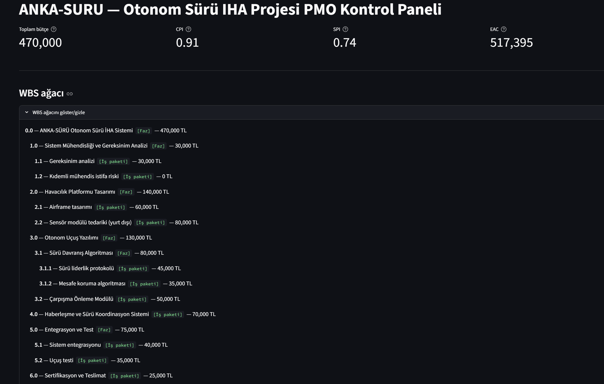
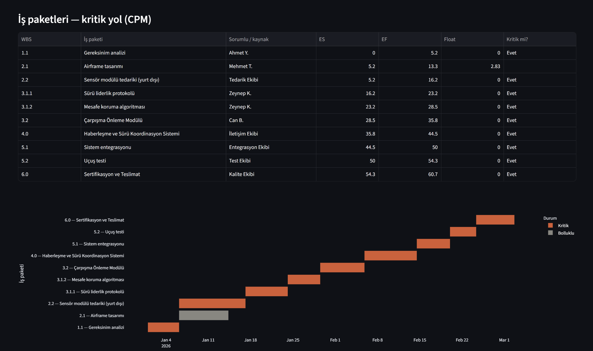
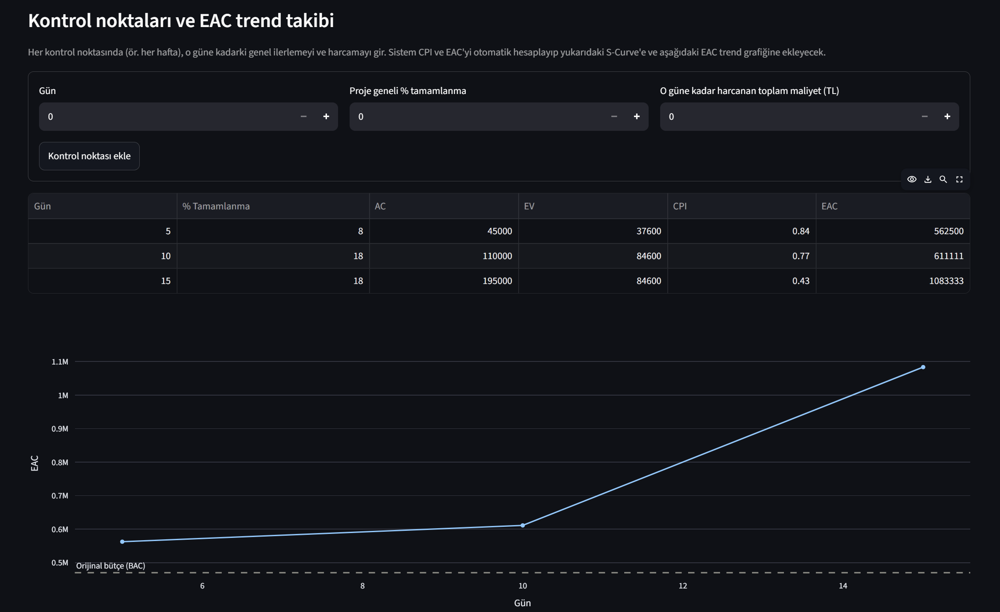
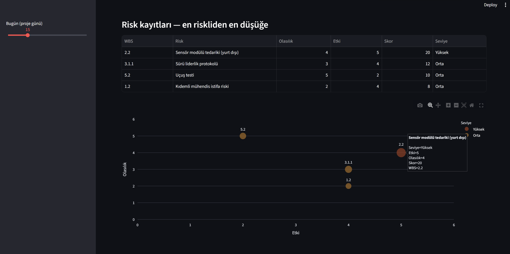

# ANKA-SÜRÜ — Otonom Sürü İHA Geliştirme Projesi | PMO Kontrol Paneli

*A Python-based Project Management Office (PMO) dashboard, built to demonstrate*
*OOP-driven project management mathematics for a fictional defense-industry program.*

---

## 🇹🇷 Türkçe

### Proje Hakkında

ANKA-SÜRÜ, kurgusal bir "Otonom Sürü İHA" geliştirme projesinin **Proje Yönetim Ofisi (PMO)**
süreçlerini uçtan uca modelleyen, Python ve Nesne Yönelimli Programlama (OOP) ile
geliştirilmiş bir kontrol panelidir. Bu proje, Yönetim Bilişim Sistemleri (YBS) geçmişiyle
proje yönetimi teorisini ve yazılım geliştirme pratiğini birleştirme becerisini göstermek
amacıyla hazırlanmıştır.

Amaç, PMO'da kullanılan klasik yöntemleri (WBS, CPM, PERT, EVM vb.) sadece teorik olarak
bilmek değil, bu yöntemlerin **matematiksel mantığını kodla ifade edebilmektir.**

### Neden Bu Proje?

Türkiye'nin lider savunma sanayii ve teknoloji şirketlerinde (ASELSAN, TUSAŞ, HAVELSAN gibi)
PMO veya Sistem Analistliği rollerine hazırlanırken, bilgimi sadece CV'de bir cümle olarak
değil, somut ve incelenebilir bir eser olarak göstermek istedim. Bu proje, YBS eğitimimin
kazandırdığı proje yönetimi teorisiyle, kendi kendime geliştirdiğim Python/OOP becerilerini
birleştiren bir portföy çalışmasıdır.

### Uygulanan PMO Metodolojileri

| Modül | Ne Yapar | Temel Formül/Mantık |
|---|---|---|
| **WBS** (İş Kırılım Yapısı) | Projeyi hiyerarşik iş paketlerine böler | Ağaç yapısı (composite pattern) |
| **CPM** (Kritik Yol Metodu) | En erken bitiş tarihini ve kritik görevleri bulur | ES/EF (ileri geçiş), LS/LF (geri geçiş), Float = LS−ES |
| **PERT** (Olasılıksal Süre Tahmini) | Belirsiz süreleri istatistiksel olarak modeller | TE = (O+4M+P)/6, σ = (P−O)/6 |
| **EVM** (Kazanılmış Değer Yönetimi) | Bütçe/takvim performansını ölçer, bitiş maliyetini öngörür | SPI = EV/PV, CPI = EV/AC, EAC = BAC/CPI |
| **Kaynak Kısıtlı Zamanlama** | Aynı kaynağın çakışan atamalarını çözer | Float önceliğiyle sıralama |
| **Risk Matrisi** | Riskleri olasılık × etki ile skorlar | Risk Skoru = Olasılık × Etki |

### Ekran Görüntüleri

**Proje sağlık özeti — BAC/CPI/SPI/EAC metrikleri ve WBS hiyerarşisi**


**Kritik yol analizi — CPM tablosu ve Gantt şeması**


**Kazanılmış değer performansı ve bütçe sapma trendi (EAC)**


**Olasılık × Etki risk skorlaması ve risk matrisi**


### Mimari

Proje, **hesaplama mantığı** ile **veri** ve **arayüzü** birbirinden ayıran katmanlı bir
mimariyle kuruldu:

```
anka_suru_core.py   → WorkPackage sınıfı: tüm PMO matematiği burada
proje_verisi.py      → ANKA-SÜRÜ'nün gerçek WBS ağacı, bu sınıfı kullanarak kurulur
app.py                → Streamlit arayüzü; SADECE görselleştirme yapar, hesaplama yapmaz
```

Bu ayrım, "separation of concerns" (kaygıların ayrılması) prensibinin somut bir uygulamasıdır:
veri veya arayüz değişse bile, çekirdek hesaplama mantığına dokunulmaz.

### Kurulum ve Çalıştırma

```bash
pip install streamlit pandas plotly
streamlit run app.py
```

### Öne Çıkan Teknik Detaylar

- **Özyinelemeli (recursive) algoritmalar:** CPM'in ileri/geri geçişi ve WBS ağaç gezinimi,
  görevlerin birbirini tetiklediği özyinelemeli fonksiyonlarla çözüldü.
- **Composite Pattern:** WBS hiyerarşisi, klasik bir nesne yönelimli tasarım deseniyle modellendi.
- **Streamlit `session_state`:** Kullanıcının girdiği EVM kontrol noktaları, sayfa yeniden
  çalıştığında kaybolmadan biriktirildi.
- **Plotly ile interaktif görselleştirme:** Gantt şeması, risk scatter plot ve EAC trend grafiği.

---

## 🇬🇧 English

### About the Project

ANKA-SÜRÜ is a Python-based PMO (Project Management Office) dashboard that models the
end-to-end management of a fictional "Autonomous Swarm UAV" development program. Built with
Object-Oriented Programming principles, it was created to demonstrate the ability to combine
a Management Information Systems (MIS) background with hands-on software engineering —
translating classical project management theory into working, testable code.

The goal was not just to *know* PMO methodologies (WBS, CPM, PERT, EVM, etc.) but to
**express their mathematical logic in code.**

### Why This Project?

While preparing for PMO and Systems Analyst roles at Turkey's leading defense and technology
companies (ASELSAN, TUSAŞ, HAVELSAN and similar), I wanted to demonstrate my knowledge not
just as a line on a CV, but as a concrete, reviewable body of work. This project combines
the project management theory from my MIS education with Python/OOP skills I developed
independently, as a portfolio piece.

### Implemented PMO Methodologies

| Module | Purpose | Core Formula/Logic |
|---|---|---|
| **WBS** (Work Breakdown Structure) | Decomposes the project into hierarchical work packages | Tree structure (composite pattern) |
| **CPM** (Critical Path Method) | Finds the earliest finish date and critical tasks | ES/EF (forward pass), LS/LF (backward pass), Float = LS−ES |
| **PERT** (Program Evaluation and Review Technique) | Models uncertain durations statistically | TE = (O+4M+P)/6, σ = (P−O)/6 |
| **EVM** (Earned Value Management) | Measures cost/schedule performance, forecasts final cost | SPI = EV/PV, CPI = EV/AC, EAC = BAC/CPI |
| **Resource-Constrained Scheduling** | Resolves overlapping assignments for the same resource | Float-based priority ordering |
| **Risk Matrix** | Scores risks via probability × impact | Risk Score = Probability × Impact |

### Architecture

The project follows a layered architecture that separates **calculation logic** from
**data** and the **interface**:

```
anka_suru_core.py   → WorkPackage class: all PMO math lives here
proje_verisi.py      → ANKA-SÜRÜ's actual WBS tree, built using this class
app.py                → Streamlit UI; ONLY visualizes, never calculates
```

This separation of concerns means the core calculation engine never needs to change,
even if the data or the interface does.

### Setup & Run

```bash
pip install streamlit pandas plotly
streamlit run app.py
```

### Notable Technical Details

- **Recursive algorithms:** CPM's forward/backward pass and WBS tree traversal are both
  solved via tasks recursively triggering each other.
- **Composite Pattern:** The WBS hierarchy is modeled using a classic OOP design pattern.
- **Streamlit `session_state`:** User-entered EVM checkpoints persist across page reruns.
- **Interactive visualization with Plotly:** Gantt chart, risk scatter plot, and EAC trend line.

---

### Proje Yapısı / Project Structure

```
anka-suru/
├── anka_suru_core.py     # Çekirdek hesaplama mantığı / Core calculation engine
├── proje_verisi.py       # WBS ağacı ve örnek veri / WBS tree and sample data
├── app.py                # Streamlit dashboard
├── test_anka_suru.py     # Otomatik testler / Automated tests
├── assets/                # Ekran görüntüleri / Screenshots
│   ├── genel_bakis.png
│   ├── gantt_semasi.png
│   ├── evm_eac_trend.png
│   └── risk_matrisi.png
└── README.md
```

---

### Geliştirici / Developer

**Nisa**
🔗 LinkedIn: [linkedin.com/in/nisaksoy](https://www.linkedin.com/in/nisaksoy/)
✉️ E-posta / Email: nisanurraksy@gmail.com
